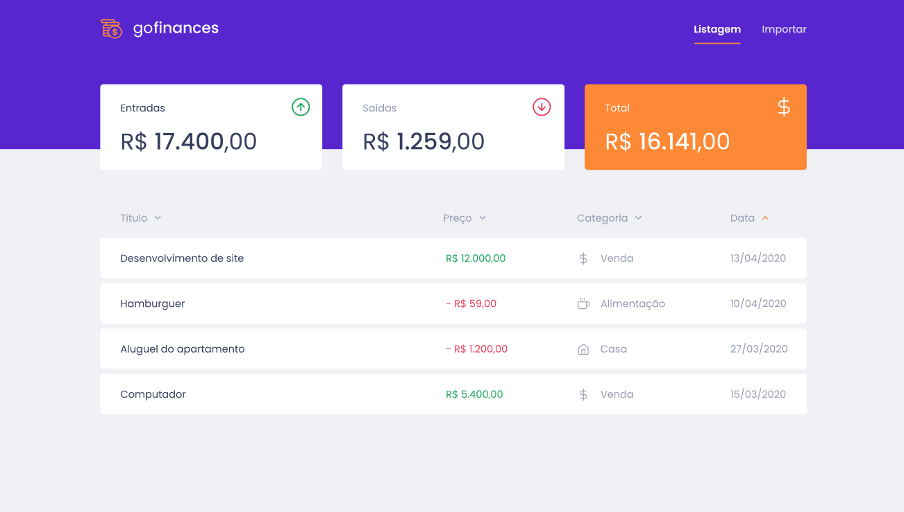
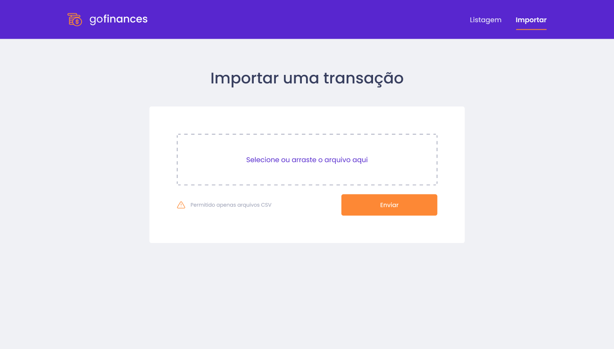

# GoFinances
An app that controls your finances.

### Tools used

- React
- Typescript
- [GoFinances Back-End API](https://github.com/viniciusfer01/goFinances-back-end)

### Results

_Home Page_ 

_Import Page_ 

### Things to do

- [x] List all income transactions
- [x] List all outcome transactions
- [x] Show account balance
- [X] Receive uploaded CSV file

### How to run it?

First, have [GoFinances Back-End API](https://github.com/viniciusfer01/goFinances-back-end) running in your machine.

Then,

1. `git clone https://github.com/viniciusfer01/goFinances-back-end.git`
2. `cd goFinances-back-end`
3. `yarn`
4. `yarn start`

